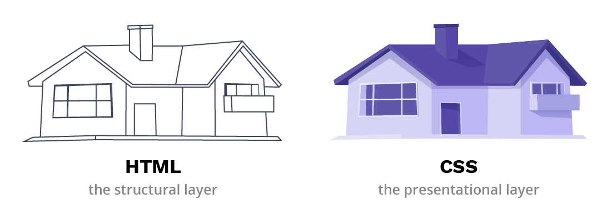
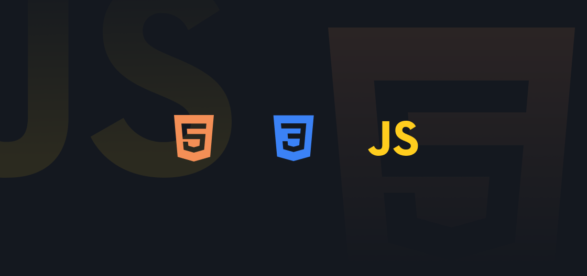

# video-aulas
Repositório destinado para fins didáticos.
 

  <!-- Carrossel -->
            

                

                    <button type="button" data-bs-target="#carouselExampleIndicators" data-bs-slide-to="0" class="active" aria-current="true" aria-label="Slide 1"></button>
                    <button type="button" data-bs-target="#carouselExampleIndicators" data-bs-slide-to="1" aria-label="Slide 2"></button>
                    <button type="button" data-bs-target="#carouselExampleIndicators" data-bs-slide-to="2" aria-label="Slide 3"></button>
                

                

                    

                        
                        

                            <h5>Aprenda HTML</h5>
                            
Introdução ao desenvolvimento de páginas web.

                        

                    

                    

                        
                        

                            <h5>Aprenda CSS</h5>
                            
Criação de layouts estilizados e responsivos.

                        

                    

                    

                        
                        

                            <h5>Aprenda Bootstrap</h5>
                            
Facilite o design responsivo com este framework poderoso.

                        

                    

                

                <button class="carousel-control-prev" type="button" data-bs-target="#carouselExampleIndicators" data-bs-slide="prev">
                    
                    Anterior
                </button>
                <button class="carousel-control-next" type="button" data-bs-target="#carouselExampleIndicators" data-bs-slide="next">
                    
                    Próximo
                </button>
            

